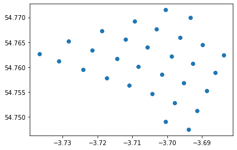
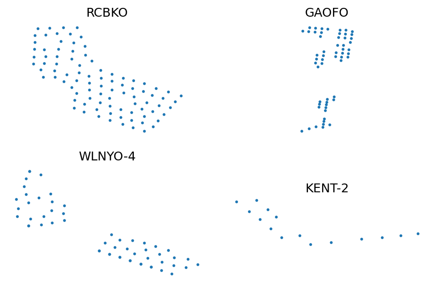
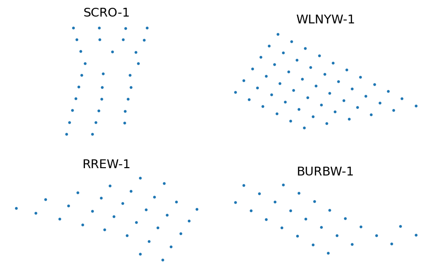
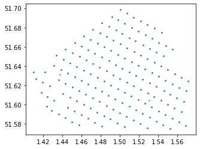

# Sample Layouts


```python
#exports
import json
import numpy as np
import pandas as pd

import requests
```

```python
import matplotlib.pyplot as plt
import FEAutils as hlp

from IPython.display import JSON
```

<br>

### Retrieving Wind Turbine Coordinates

We'll start by retrieving the wind farm data available from the crown estate wind resource map. We could use sources such as OpenStreetMap but the Crown Estate is a better primary source for this work.

```python
crown_estate_data_url = 'https://raw.githubusercontent.com/OSUKED/Crown-Estate-Watch/master/data/wind_farm_data.json'

crown_estate_data = requests.get(crown_estate_data_url).json()

JSON(crown_estate_data)
```


    <IPython.core.display.JSON object>


<br>

Next we'll create a function for cleaning the turbine coordinates from a single wind farm

```python
#exports
def clean_turbine_coords(turbine_coords):
    if turbine_coords == '':
        return {'latitude': [], 'longitude': []}
    
    turbine_coords = (pd
                      .Series(turbine_coords.replace(';"', '; "').split('; '))
                      .str.replace('"', '')
                      .str.replace(';', '')
                      .str.split(',')
                      .apply(pd.Series)
                      .rename(columns={
                          0: 'latitude', 
                          1: 'longitude'
                      })
                      .astype(float)
                      .to_dict(orient='list')
                     )
    
    return turbine_coords
```

```python
turbine_coords = crown_estate_data['WindFarms'][0]['TurbineCordinates'] 

df_turbine_coords = pd.DataFrame(clean_turbine_coords(turbine_coords))

df_turbine_coords.head()
```


|    |   latitude |   longitude |
|---:|-----------:|------------:|
|  0 |   -3.70052 |     54.7715 |
|  1 |   -3.69345 |     54.7699 |
|  2 |   -3.70933 |     54.7692 |
|  3 |   -3.70313 |     54.7676 |
|  4 |   -3.69627 |     54.7659 |</div>


<br>

We'll now repeat this for all sites and filter out those that have no coordinate data

```python
#exports
def retrieve_turbine_coords(crown_estate_data):
    # Extracting turbine coordinates
    wf_id_to_turbine_coords = {
        wf['Id']: clean_turbine_coords(wf['TurbineCordinates'])
        for wf 
        in crown_estate_data['WindFarms'] 
        if 'TurbineCordinates' in wf.keys()
    }

    # Removing empty coordinates
    wf_id_to_turbine_coords = {
        id_: turbine_coords 
        for id_, turbine_coords 
        in wf_id_to_turbine_coords.items() 
        if len(turbine_coords['latitude']) > 0
    }
    
    return wf_id_to_turbine_coords
```

```python
wf_id_to_turbine_coords = retrieve_turbine_coords(crown_estate_data)

latitudes, longitudes = wf_id_to_turbine_coords['RREW-1'].values()

plt.scatter(latitudes, longitudes)
```


    <matplotlib.collections.PathCollection at 0x213414a96d0>





<br>

To get a high-level overview of what our data looks like we can plot random wind farms

```python
fig, axs = plt.subplots(dpi=150, nrows=2, ncols=2)
axs = axs.flatten()

sample_ids = np.random.choice(list(wf_id_to_turbine_coords.keys()), len(axs), replace=False)

for ax_idx, sample_id in enumerate(sample_ids):
    ax = axs[ax_idx]
    latitudes, longitudes = wf_id_to_turbine_coords[sample_id].values()
    
    ax.scatter(latitudes, longitudes, s=3)
    ax.set_title(sample_id)
    
for ax in axs:
    hlp.hide_spines(ax, positions=['top', 'bottom', 'left', 'right'])
    ax.set_xticks([])
    ax.set_yticks([])
    ax.set_aspect('equal', adjustable='box')

fig.tight_layout(h_pad=2, w_pad=2)
```





<br>

Lincs wind farm looks like it has a particularly bizarre layout, that is until it's plotted alongside the neighbouring wind farms of Lynn and Inner Dowsing. For groups of sites such as these, the layouts we generate are likely to differ significantly from reality due to the way we separate them.

```python
wf_group = ['LNCSW', 'INNDW-1', 'LYNNW-1']

for wf in wf_group:
    latitudes, longitudes = wf_id_to_turbine_coords[wf].values()
    plt.scatter(latitudes, longitudes)
    plt.gca().set_aspect('equal', adjustable='box')
```





```python
s_num_turbines = pd.Series({k: len(v['latitude']) for k, v in wf_id_to_turbine_coords.items()}).sort_values(ascending=False)

s_num_turbines.head(10)
```


    LARYO    175
    HOWAO    174
    GYMRW    160
    GRGBW    140
    RMPNO    116
    WDNSW    108
    THNTW    100
    RCBKO     91
    SHRSO     89
    LNCSW     75
    dtype: int64


```python
wf_id_to_name = {wf['Id']: wf['Name'] for wf in crown_estate_data['WindFarms']}

pd.Series({k: wf_id_to_name[k] for k in wf_id_to_turbine_coords.keys()}).loc[s_num_turbines.head(15).index]
```


    LARYO            London Array 1
    HOWAO               Hornsea One
    GYMRW               Gwynt y Mor
    GRGBW           Greater Gabbard
    RMPNO         Rampion Wind Farm
    WDNSW      West of Duddon Sands
    THNTW                    Thanet
    RCBKO                 Race Bank
    SHRSO          Sheringham Shoal
    LNCSW                     Lincs
    HMGTO            Humber Gateway
    DDGNO                   Dudgeon
    WLNYO-4      Walney Extension 4
    GAOFO                  Galloper
    WLNYO-2                Walney 2
    dtype: object


<br>

N.b. The Overpass-Turbo query used can be found [here](https://overpass-turbo.eu/s/13UC)

```python
wf_id_to_substation_coords = {
    'LARYO': {'latitudes': [1.438, 1.531], 'longitudes': [51.631, 51.604]}, # manual based on image from https://www.escaeu.org/articles/submarine-power-cables/
    'HOWAO': {'latitudes': [1.714, 1.8955, 2.102], 'longitudes': [53.89, 53.878, 53.878]}, # manual based on image from p4 - https://www.ofgem.gov.uk/system/files/docs/2018/10/hornsea_one_project_presentation.pdf
    'GYMRW': {'latitudes': [-3.624, -3.54], 'longitudes': [53.4372, 53.466]}, # manual based on image from https://www.kinewell.co.uk/gwynt-y-mor
    'RMPNO': {'latitudes': [1.947, 1.959, 1.884, 1.981], 'longitudes': [51.908, 51.9655, 51.919, 51.779]}, # manual based on image from p16 - http://nearyou.imeche.org/docs/greater-manchester-area-past-presentations/offshore-wind.pdf
    'RMPNO': {'latitudes': [-0.259818], 'longitudes': [50.692888]}, # https://www.rampionoffshore.com/app/uploads/2017/06/offshore-substation.json - this was found looking at the requests for this page - https://www.rampionoffshore.com/wind-farm/map/
    'WDNSW': {'latitudes': [-3.4337], 'longitudes': [53.989]}, # manual based on image from https://www.sintef.no/globalassets/project/eera-deepwind2016/presentations/x2_merz.pdf
    'THNTW': {'latitudes': [1.621919], 'longitudes': [51.4375182]}, # overpass, then confirmed here - https://www.researchgate.net/publication/318893622_Optimizing_wind_farm_cable_routing_considering_power_losses/figures?lo=1
    'RCBKO': {'latitudes': [0.808, 0.867], 'longitudes': [53.295, 53.256]}, # manual based on image from https://www.ofgem.gov.uk/system/files/docs/2016/10/race_bank_presentation.pdf
    'SHRSO': {'latitudes': [1.175819, 1.120607], 'longitudes': [53.126704, 53.144141]}, # overpass
    'LNCSW': {'latitudes': [0.4906076], 'longitudes': [53.188448]} # overpass
}
```

```python
latitudes, longitudes = wf_id_to_turbine_coords['LARYO'].values()
plt.scatter(latitudes, longitudes, s=3)
plt.gca().set_aspect('equal', adjustable='box')

plt.scatter([1.438, 1.531], [51.631, 51.604], s=3) 
```


    <matplotlib.collections.PathCollection at 0x213478b1d60>




